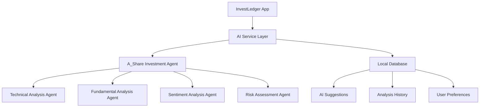

# 📊 InvestLedger

<div align="center">


**轻量级个人投资记账应用 - 让投资管理更简单智能**

[功能特性](#-功能特性) • [快速开始](#-快速开始) • [技术架构](#-技术架构) • [AI集成](#-ai投资助手) • [贡献指南](#-贡献指南)

</div>

---

## 🎯 项目简介

InvestLedger 是一款现代化的个人投资记账应用，专为投资者设计，提供完整的投资组合管理和智能分析功能。应用采用 Flutter 跨平台框架开发，支持 Android、iOS、Windows、macOS 和 Linux 平台。

### ✨ 核心亮点

- 🎨 **现代化设计** - Material Design 3 + 动态主题色彩
- 🤖 **AI投资助手** - 集成智能投资分析系统
- 📱 **跨平台支持** - 一套代码，多端运行
- 🔄 **实时同步** - 本地数据库 + 云端备份
- 📊 **可视化分析** - 丰富的图表和统计功能
- 👥 **共享投资** - 支持多人协作投资管理

## 🚀 功能特性

### 📈 投资管理
- **交易记录** - 完整的买卖交易记录管理
- **投资组合** - 实时投资组合分析和追踪
- **盈亏统计** - 详细的盈亏分析和历史趋势
- **目标设定** - 月度/年度投资目标管理
- **标签分类** - 灵活的交易标签和分类系统

### 🤖 AI投资助手
- **智能分析** - 基于多Agent系统的股票分析
- **投资建议** - AI生成的个性化投资建议
- **风险评估** - 智能风险评估和预警
- **策略回测** - 投资策略历史回测功能
- **市场洞察** - 实时市场数据和趋势分析

### 👥 协作功能
- **共享投资** - 多人共同投资项目管理
- **权限控制** - 灵活的用户权限管理
- **实时协作** - 多用户实时数据同步
- **收益分配** - 自动化收益分配计算

### 📊 数据分析
- **可视化图表** - 丰富的图表展示
- **统计报告** - 详细的投资统计报告
- **趋势分析** - 投资趋势和模式识别
- **导入导出** - 支持 CSV、Excel、PDF 格式

### 🎨 用户体验
- **响应式设计** - 适配各种屏幕尺寸
- **暗黑模式** - 支持明暗主题切换
- **动画效果** - 流畅的页面转场动画
- **离线支持** - 完整的离线功能支持

## 📱 界面预览

<div align="center">


</div>

## 🛠 技术架构

### 核心技术栈
- **框架**: Flutter 3.16.0+
- **语言**: Dart 3.2.0+
- **状态管理**: Riverpod 2.4.9
- **数据库**: SQLite (sqflite)
- **路由**: GoRouter 12.1.3
- **UI组件**: Material Design 3

### 架构模式
```
lib/
├── app/                    # 应用配置
│   ├── app.dart           # 应用入口
│   ├── routes.dart        # 路由配置
│   └── theme.dart         # 主题配置
├── core/                  # 核心功能
│   ├── config/           # 配置文件
│   ├── constants/        # 常量定义
│   ├── exceptions/       # 异常处理
│   ├── extensions/       # 扩展方法
│   └── utils/           # 工具类
├── data/                 # 数据层
│   ├── database/        # 数据库
│   ├── datasources/     # 数据源
│   ├── models/          # 数据模型
│   ├── repositories/    # 仓储层
│   └── services/        # 服务层
├── domain/              # 业务逻辑层
├── presentation/        # 表现层
│   ├── pages/          # 页面
│   ├── providers/      # 状态提供者
│   ├── utils/          # UI工具
│   └── widgets/        # 组件
└── shared/             # 共享模块
    ├── services/       # 共享服务
    └── widgets/        # 共享组件
```

### 设计模式
- **Clean Architecture** - 清晰的分层架构
- **Repository Pattern** - 数据访问抽象
- **Provider Pattern** - 状态管理
- **Factory Pattern** - 对象创建
- **Observer Pattern** - 事件监听

## 🤖 AI投资助手

InvestLedger 集成了先进的AI投资分析系统，提供智能化的投资决策支持。

### AI功能特性
- **多Agent分析** - 集成多个专业投资分析Agent
- **实时股票分析** - 基于实时数据的股票分析
- **投资建议生成** - 个性化投资建议和策略
- **风险评估** - 智能风险识别和预警
- **策略回测** - 历史数据回测验证

### AI集成架构


### 使用流程
1. **股票分析** - 输入股票代码，获取AI分析结果
2. **建议管理** - 查看、执行或忽略AI投资建议
3. **策略优化** - 基于历史表现优化投资策略
4. **风险控制** - 实时风险监控和预警

## 🚀 快速开始

### 环境要求
- Flutter SDK 3.16.0+
- Dart SDK 3.2.0+
- Android Studio / VS Code
- Git

### 安装步骤

1. **克隆项目**
```bash
git clone https://github.com/0xXu/invest_ledger-flutter.git
cd invest_ledger-flutter
```

2. **安装依赖**
```bash
flutter pub get
```

3. **生成代码**
```bash
flutter packages pub run build_runner build
```

4. **运行应用**
```bash
# 调试模式
flutter run

# 发布模式
flutter run --release
```

### 平台特定配置

#### Android
```bash
# 构建 APK
flutter build apk --release

# 构建 App Bundle
flutter build appbundle --release
```

#### iOS
```bash
# 构建 iOS 应用
flutter build ios --release
```

#### Desktop
```bash
# Windows
flutter build windows --release

# macOS
flutter build macos --release

# Linux
flutter build linux --release
```

## 📦 依赖管理

### 主要依赖
```yaml
dependencies:
  # 状态管理
  flutter_riverpod: ^2.4.9
  riverpod_annotation: ^2.3.3

  # 数据库
  sqflite: ^2.3.0
  path: ^1.8.3

  # UI组件
  material_color_utilities: ^0.11.1
  dynamic_color: ^1.6.8
  flex_color_scheme: ^7.3.1

  # 路由
  go_router: ^12.1.3

  # 图表
  fl_chart: ^0.65.0

  # 文件处理
  file_picker: ^8.0.0
  csv: ^5.0.2
  excel: ^2.1.0
  pdf: ^3.10.7
```

### 开发依赖
```yaml
dev_dependencies:
  # 代码生成
  build_runner: ^2.4.7
  json_serializable: ^6.7.1
  freezed: ^2.4.6
  riverpod_generator: ^2.3.9

  # 测试
  flutter_test:
    sdk: flutter
  flutter_lints: ^5.0.0
```

## 🧪 测试

### 运行测试
```bash
# 运行所有测试
flutter test

# 运行特定测试文件
flutter test test/unit/transaction_test.dart

# 运行集成测试
flutter test integration_test/
```

### 测试覆盖率
```bash
# 生成测试覆盖率报告
flutter test --coverage
genhtml coverage/lcov.info -o coverage/html
```

## 📚 项目文档

### 开发文档
- [AI助手集成指南](docs/ai_assistant_integration_phase1.md)
- [AI服务配置](docs/ai_service_config_feature.md)
- [全局加载系统](docs/global_loading_system.md)
- [性能优化指南](docs/performance_optimization.md)
- [版本更新系统](docs/version_update_system.md)

### 开发指南
- [Git工作流程](docs/git_guidelines.md)
- [发布自动化](docs/release_automation.md)
- [发布GUI指南](docs/release_gui_guide.md)
- [系统字体指南](docs/system_fonts_guide.md)

## 🔧 开发工具

### 代码生成
```bash
# 生成所有代码
flutter packages pub run build_runner build

# 监听文件变化并自动生成
flutter packages pub run build_runner watch

# 清理并重新生成
flutter packages pub run build_runner build --delete-conflicting-outputs
```

### 代码格式化
```bash
# 格式化代码
dart format .

# 分析代码
flutter analyze

# 修复可自动修复的问题
dart fix --apply
```

## 🚀 部署

### Android 部署
1. **配置签名**
   - 创建 `android/key.properties`
   - 配置 `android/app/build.gradle`

2. **构建发布版本**
```bash
flutter build appbundle --release
```

3. **上传到 Google Play**
   - 使用 Google Play Console
   - 上传 `build/app/outputs/bundle/release/app-release.aab`

### iOS 部署
1. **配置证书**
   - 在 Xcode 中配置开发者证书
   - 设置 Bundle Identifier

2. **构建发布版本**
```bash
flutter build ios --release
```

3. **上传到 App Store**
   - 使用 Xcode Archive
   - 通过 App Store Connect 发布

### Desktop 部署
```bash
# Windows
flutter build windows --release

# macOS
flutter build macos --release

# Linux
flutter build linux --release
```

## 🤝 贡献指南

我们欢迎所有形式的贡献！请遵循以下步骤：

### 贡献流程
1. **Fork 项目**
2. **创建功能分支** (`git checkout -b feature/AmazingFeature`)
3. **提交更改** (`git commit -m 'Add some AmazingFeature'`)
4. **推送到分支** (`git push origin feature/AmazingFeature`)
5. **创建 Pull Request**

### 代码规范
- 遵循 [Dart Style Guide](https://dart.dev/guides/language/effective-dart/style)
- 使用 `flutter analyze` 检查代码质量
- 确保所有测试通过
- 添加必要的文档和注释

### 提交规范
使用 [Conventional Commits](https://www.conventionalcommits.org/) 规范：
```
feat: 添加新功能
fix: 修复bug
docs: 更新文档
style: 代码格式调整
refactor: 代码重构
test: 添加测试
chore: 构建过程或辅助工具的变动
```

## 📄 许可证

本项目采用 MIT 许可证 - 查看 [LICENSE](LICENSE) 文件了解详情。

---

<div align="center">

**如果这个项目对你有帮助，请给它一个 ⭐️**


</div>
